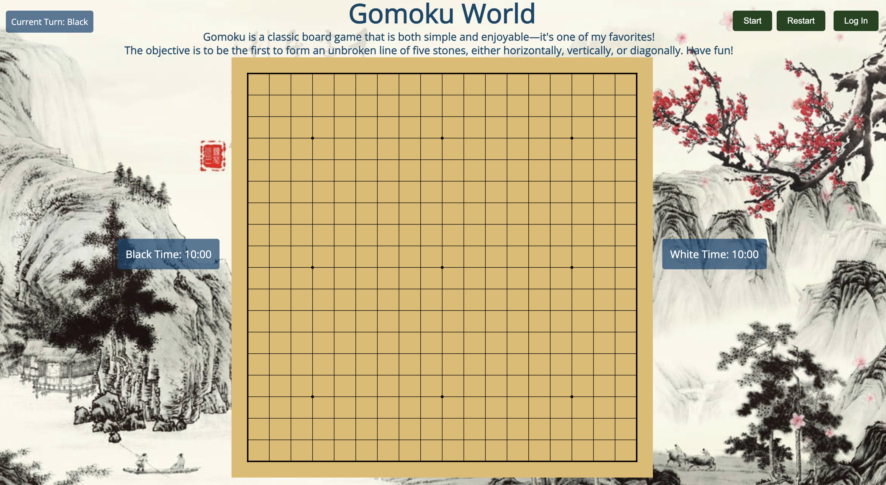

# Gomoku Game - Two Player Edition

Welcome to the **Gomoku Game - Two Player Edition**! This is a classic board game where two players compete to be the first to get five of their stones in a row on a 19x19 grid. 

---

## Table of Contents

- [Features](#features)
- [Installation](#installation)
- [How to Play](#how-to-play)
- [Game Rules](#game-rules)
- [Requirements](#requirements)
- [Technologies Used](#technologies-used)
- [Contributing](#contributing)
- [License](#license)
- [Authors](#authors)
- [Roadmap](#roadmap)


---

## Features

- **Two-Player Local Gameplay**: Play with a friend on the same device.
- **Intuitive GUI**: Easy-to-use graphical user interface.
- **Winning Highlight**: Highlights the winning sequence of stones.
- **Undo Move**: Allows players to undo the last move. (Waiting for Development)
- **Restart Game**: Option to restart the game at any time. (Waiting for Development)
- **Responsive Design**: Adjusts to different screen sizes. 
- **Cross-Platform Compatibility**: Runs on any modern web browser.

---
<!--
## Demo

*Note: Insert link to a live demo or a video if available.*
-->
---

## Installation

### Prerequisites

- A modern web browser (Google Chrome, Mozilla Firefox, Safari, Microsoft Edge)
<!--- - (Optional) Node.js and npm installed for running a local server or building from source -->

### Steps

#### Option 1: Run Locally

1. **Clone the Repository**

   ```bash
   git clone https://github.com/EMC2016/gomoku_game.git
   ```

2. **Navigate to the Project Directory**

   ```bash
   cd gomoku-game
   ```

3. **Open `index.html` in Your Browser**

   - Simply double-click the `index.html` file.
   - Or, right-click `index.html` and select "Open with" and choose your web browser.
<!--
4. **(Optional) Run a Local Server**

   Running a local server can help avoid any issues with loading local files.

   - **Using Node.js**

     ```bash
     npm install -g http-server
     http-server
     ```

     Then open your browser and navigate to `http://localhost:8080`.

   - **Using Python (if installed)**

     ```bash
     # For Python 3.x
     python -m http.server 8080
     ```

     Then open your browser and navigate to `http://localhost:8080`.
-->
---

## How to Play

- **Start the Game**: Open `index.html` in your web browser or access the live demo.
- **Gameplay**:
  - Player 1 uses black stones.
  - Player 2 uses white stones.
  - Players take turns clicking on an empty grid cell to place their stone.
- **Winning the Game**:
  - The first player to align five stones horizontally, vertically, or diagonally wins.
<!--
- **Undo Move**: Click the 'Undo' button to revert the last move.
- **Restart Game**: Click the 'Restart' button to start a new game.
-->

---

## Game Rules

- **Objective**: Align five of your stones in a row before your opponent does.
- **Turns**:
  - Black stones (Player 1) always start first.
  - Players alternate turns, placing one stone per turn.
- **Winning Condition**:
  - The game ends when a player forms an unbroken row of five stones.
  - The row can be horizontal, vertical, or diagonal.
- **Draw**:
  - If all cells are filled without any player achieving five in a row, the game is a draw.

---
<!--
## Screenshots

*Include screenshots to showcase the game interface.*


*Figure 1: Game start screen.*


*Figure 2: Mid-game gameplay.*


*Figure 3: Winning sequence highlighted.*

---
-->

## Requirements

- **Web Browser**: A modern web browser such as:
  - Google Chrome
  - Mozilla Firefox
  - Safari
  - Microsoft Edge
- **Operating System**: Any OS that supports the above browsers (Windows, macOS, Linux)

---

## Technologies Used

- **Programming Language**: JavaScript (ES6)
- **Markup and Styling**:
  - HTML5
  - CSS3
<!--
- **Frameworks/Libraries**:
  - *(If any, e.g., React.js, Vue.js, or jQuery)*
-->
- **Version Control**: Git

---

## License

This project is licensed under the MIT License.

---

## Authors

- **Emma Chen** - *Developer* - [YourGitHubUsername](https://github.com/EMC2016)

---


## Roadmap

- [ ] Add AI opponent for single-player mode.
- [ ] Implement online multiplayer functionality.
- [ ] Add customizable board sizes.
- [ ] Improve the graphical interface with enhanced visuals.
- [ ] Support for mobile devices via responsive design.

---


Thank you for checking out our Gomoku game! We hope you enjoy playing it as much as we enjoyed creating it. Your feedback and contributions are greatly appreciated.

